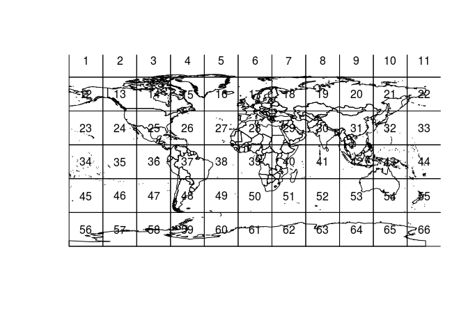
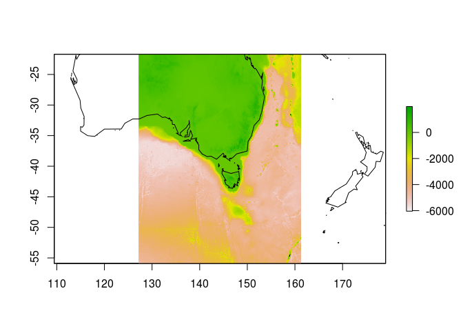

<!-- README.md is generated from README.Rmd. Please edit that file -->
tropo
=====

Tools to tile rasters.

Example
-------

We have a topography file installed.

``` r
library(tropo)
topofile <- tropo:::.etopo2()

print(topofile)
```

    #> [1] "data/www.ngdc.noaa.gov/mgg/global/relief/ETOPO2/ETOPO2v2-2006/ETOPO2v2c/netCDF/ETOPO2v2c_f4.nc"

Create a tiling scheme.

``` r
r <- raster(topofile)
ts <- tiles(raster(topofile), blockX = 1024, blockY = 1024)
#> NOTE: rgdal::checkCRSArgs: no proj_defs.dat in PROJ.4 shared files
```

Compare it to the input:

``` r
r
#> class       : RasterLayer 
#> dimensions  : 5400, 10800, 58320000  (nrow, ncol, ncell)
#> resolution  : 0.03333333, 0.03333333  (x, y)
#> extent      : -180, 180, -90, 90  (xmin, xmax, ymin, ymax)
#> coord. ref. : NA 
#> data source : /rdsi/PRIVATE/data/www.ngdc.noaa.gov/mgg/global/relief/ETOPO2/ETOPO2v2-2006/ETOPO2v2c/netCDF/ETOPO2v2c_f4.nc 
#> names       : z 
#> zvar        : z
ts$tileraster
#> class       : RasterLayer 
#> dimensions  : 6, 11, 66  (nrow, ncol, ncell)
#> resolution  : 34.13333, 34.13333  (x, y)
#> extent      : -180, 195.4667, -90, 114.8  (xmin, xmax, ymin, ymax)
#> coord. ref. : +proj=longlat +datum=WGS84 +ellps=WGS84 +towgs84=0,0,0 
#> data source : in memory
#> names       : layer 
#> values      : 1, 66  (min, max)
```

Generate actual tiles with it.

``` r
 for (i in seq(ncell(ts$tileraster))) {
   tile <- crop(r, ts$poly[i, ], snap = "out")
   save(tile, file = sprintf("output/tile_%03i.rdata", i))
 }
```

Select a tile.

``` r
library(maptools)
#> Checking rgeos availability: TRUE
data(wrld_simpl)
plot(wrld_simpl)
plot(ts$poly, add = TRUE)
text(ts$poly, lab = ts$poly$tile)
```



``` r
#dput(ts$poly$tile[click(ts$poly, n = 1)])
## 54L
```

Plot that tile.

``` r
load(sprintf("output/tile_%03i.rdata", 54))
plot(tile)
plot(wrld_simpl, add = TRUE)
```


