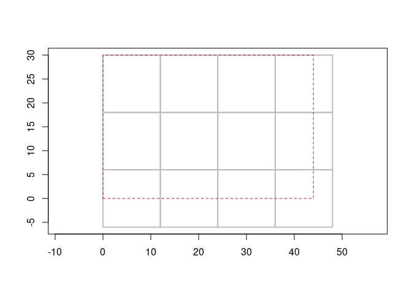

<!-- README.md is generated from README.Rmd. Please edit that file -->
<!-- badges: start -->

[](https://www.tidyverse.org/lifecycle/#experimental)
[](https://CRAN.R-project.org/package=grout)
[](https://github.com/hypertidy/grout/actions)
<!-- badges: end -->

# grout

Abstract tiling schemes.

Given a grid, impose a tiling scheme. The dangle is overlap the tiles
impose (in pixels).

We use the term “block” to refer to the size of each tile in pixels.

We use the simplest specification of a *raster grid*, which is six
numbers: *dimension* `c(ncol, nrow)` and *extent*
`c(xmin, xmax, ymin, ymax)`.

Consider a raster 16 x 12, with 4 x 4 tiling there is no overlap.

``` r
library(grout)
grout(c(4, 4), extent = c(0, 16, 0, 12), blocksize = c(4L, 4L))
#>           tiles: 1, 1 (x * y = 1)
#>           block: 4, 4 
#>          dangle: 0, 0 
#> tile resolution: 16, 12 
#>     tile extent: 0, 16, 0, 12 (xmin,xmax,ymin,ymax)
#>           grain: 16, 12 (4 : x, 4 : y)
```

But, if our raster has an dimension that doesn’t divide neatly into the
block size, then there is some tile overlap. This should work for any
raster dimension and any arbitrary tile size.

``` r
grout(c(15, 13), extent = c(0, 15, 0, 13), blocksize = c(4L, 4L))
#>           tiles: 4, 4 (x * y = 16)
#>           block: 4, 4 
#>          dangle: 1, 3 
#> tile resolution: 4, 4 
#>     tile extent: 0, 16, -3, 13 (xmin,xmax,ymin,ymax)
#>           grain: 4, 4 (4 : x, 4 : y)
```

``` r
(t1 <- grout(c(44, 30), blocksize = c(12, 12)))
#>           tiles: 3, 4 (x * y = 12)
#>           block: 12, 12 
#>          dangle: 4, 6 
#> tile resolution: 12, 12 
#>     tile extent: 0, 48, -6, 30 (xmin,xmax,ymin,ymax)
#>           grain: 12, 12 (12 : x, 12 : y)
plot(t1)
```

<!-- -->

``` r

(t2 <- grout:::.groutfrom(volcano, blocksize = c(12, 16)))
#>           tiles: 4, 8 (x * y = 32)
#>           block: 12, 16 
#>          dangle: 9, 3 
#> tile resolution: 12, 16 
#>     tile extent: 0, 96, -3, 61 (xmin,xmax,ymin,ymax)
#>           grain: 12, 16 (12 : x, 16 : y)

plot(t2)
```

<!-- -->

We can generate a table of offset indexes, for use in reading from GDAL
(say).

``` r
tile_index(t2)
#> # A tibble: 32 × 9
#>     tile offset_x offset_y  ncol  nrow  xmin  xmax  ymin  ymax
#>    <int>    <dbl>    <dbl> <dbl> <dbl> <dbl> <dbl> <dbl> <dbl>
#>  1     1        0        0    12    16     0    12    45    61
#>  2     2       12        0    12    16    12    24    45    61
#>  3     3       24        0    12    16    24    36    45    61
#>  4     4       36        0    12    16    36    48    45    61
#>  5     5       48        0    12    16    48    60    45    61
#>  6     6       60        0    12    16    60    72    45    61
#>  7     7       72        0    12    16    72    84    45    61
#>  8     8       84        0     3    16    84    87    45    61
#>  9     9        0       16    12    16     0    12    29    45
#> 10    10       12       16    12    16    12    24    29    45
#> # … with 22 more rows
```

See below for generating `wk::rct` objects from the tile index.

Or just plot the scheme.

``` r
plot(t1)
```

<!-- -->

## What for?

This gives us fine control over the exact nature of the data we can read
from large sources.

Consider this large image online:

``` r
url <- "https://services.ga.gov.au/gis/rest/services/Topographic_Base_Map/MapServer/WMTS/1.0.0/WMTSCapabilities.xml,layer=Topographic_Base_Map,tilematrixset=default028mm"
dsn <- sprintf("WMTS:%s,layer=Topographic_Base_Map,tilematrixset=default028mm", url)
info <- vapour::vapour_raster_info(dsn)
(overviews <- matrix(info$overviews, ncol = 2, byrow = TRUE))
#>            [,1]      [,2]
#>  [1,] 205851559 165517805
#>  [2,] 102925779  82758902
#>  [3,]  51462890  41379451
#>  [4,]  25731445  20689726
#>  [5,]  12865722  10344863
#>  [6,]   6432861   5172431
#>  [7,]   3216431   2586216
#>  [8,]   1608215   1293108
#>  [9,]    804108    646554
#> [10,]    402054    323277
#> [11,]    201027    161638
#> [12,]    100513     80819
#> [13,]     50257     40410
#> [14,]     25128     20205
#> [15,]     12564     10102
#> [16,]      6282      5051
#> [17,]      3141      2526
#> [18,]      1571      1263
#> [19,]       785       631
#> [20,]       393       316
#> [21,]       196       158

## level 16 is a reasonable size to experiment with
dm <- overviews[16L, , drop = TRUE]
```

The raster readers in terra or stars gives us an object that can be
operated with, if we crop it only those cell values are read - but we
have no idea about the underlying tiling of the data source itself.

With GDAL more directly we can find the underlying tile structure, which
tells us about the 256x256 tiling scheme.

``` r
info["block"]
#> $block
#> [1] 128 128
```

Now with grout we can actually generate the tile scheme and work with
it, let’s say we know that we want a region near tile number 1583. Using
the information about the tiles we can find the adjacent tile cell
numbers, then use that to crop the original source.

``` r
(tile0 <- grout(dm, info$extent, blocksize = info$block))
#>           tiles: 40, 50 (x * y = 2000)
#>           block: 128, 128 
#>          dangle: 118, 69 
#> tile resolution: 156545.3, 156549.3 
#>     tile extent: 11148027, 18975292, -6527909, -265936.2 (xmin,xmax,ymin,ymax)
#>           grain: 156545.3, 156549.3 (128 : x, 128 : y)

index <- tile_index(tile0)
polys <- wk::rct(index$xmin, index$ymin, index$xmax, index$ymax)
cl <- 1584
row <- vaster::row_from_cell((dm %/% 128) + 1, cl)
col <- vaster::col_from_cell((dm %/% 128) + 1, cl)

rowcol <- expand.grid(c(-1, 0, 1) + row, 
            c(-1, 0, 1) + col)
## adjacent (this really needs some work between grout and vaster to make it obvious and easy)
cells <- vaster::cell_from_row_col((dm %/% 128) + 1, rowcol[,1], rowcol[,2])

#cells <- raster::adjacent(tile0$tileraster, 6500, include = TRUE, directions = 8)[, "to"]
exs <- index[cells, c("xmin", "xmax", "ymin", "ymax")]
ex <- c(min(exs$xmin), max(exs$xmax), min(exs$ymin), max(exs$ymax))
im <- whatarelief::imagery(source = dsn, extent = ex, dimension = c(128, 128) * 3, projection = info$projection)
plot(polys, col = seq_along(polys) == cl)
ximage::ximage(im, extent = ex, add = TRUE)
```

<!-- -->

Finally, we have an in-memory raster of the original source data for
very specific tiles.

``` r
ximage::ximage(im, extent = ex, asp = 1)
plot(polys[cells], add = TRUE)
text(wk::wk_coords(geos::geos_centroid(polys[cells ]))[, c("x", "y")], lab = cells, col = "firebrick", cex = 1.5)
```

<!-- -->

## TODO

- [x] remove need for using sp polygons
- [ ] set tools for cropping that use the index, not spatial extent
  (i.e. extent(x, x0, x1, y0, y1))
- [x] remove use of sp and raster internally for the data structures,
  just store the information about the grid/s

------------------------------------------------------------------------

## Code of Conduct

Please note that the grout project is released with a [Contributor Code
of
Conduct](https://contributor-covenant.org/version/2/0/CODE_OF_CONDUCT.html).
By contributing to this project, you agree to abide by its terms.
