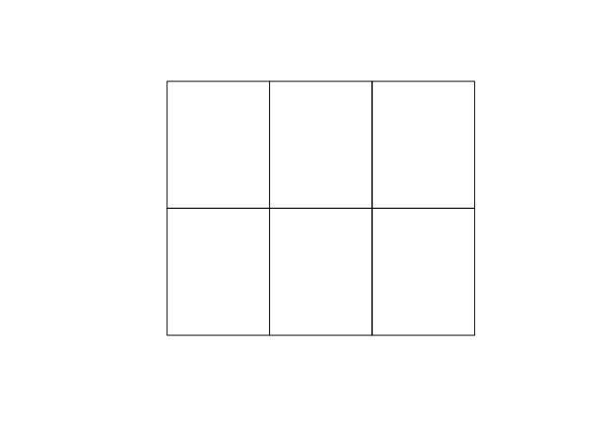

<!-- README.md is generated from README.Rmd. Please edit that file -->
<!-- badges: start -->

[](https://travis-ci.org/hypertidy/tropo)
[](https://ci.appveyor.com/project/hypertidy/tropo)
[](https://www.tidyverse.org/lifecycle/#experimental)
[](https://CRAN.R-project.org/package=tropo)
<!-- badges: end -->

tropo
=====

Abstract tiling schemes.

Given a grid, impose a tiling scheme. The dangle is how much overlap the
tiles imply.

``` r

r <- raster::raster(matrix(1:12, 30, 44), xmn= 0,xmx = 4, ymn = 0, ymx = 3)

library(tropo)
(t1 <- tiles(r, blockX = 12, blockY = 12))
#> tropo tiles: 6
#>     x tiles: 3
#>     y tiles: 2
#>      blockX: 12
#>      blockY: 12
#>      dangle: 8,6 (x,y)
plot(t1)
```


``` r

(t2 <- tiles(volcano, 12, 16))
#> tropo tiles: 25
#>     x tiles: 5
#>     y tiles: 5
#>      blockX: 12
#>      blockY: 12
#>      dangle: 1,7 (x,y)

plot(t2)
```


We can generate polygons from these.

``` r
p <- as_polys(t1)

sp::plot(p)
```



Or just plot the scheme.

``` r
plot(t1)
```


------------------------------------------------------------------------

Please note that the ‘tropo’ project is released with a [Contributor
Code of
Conduct](https://github.com/hypertidy/tropo/blob/master/CODE_OF_CONDUCT.md).
By contributing to this project, you agree to abide by its terms.
